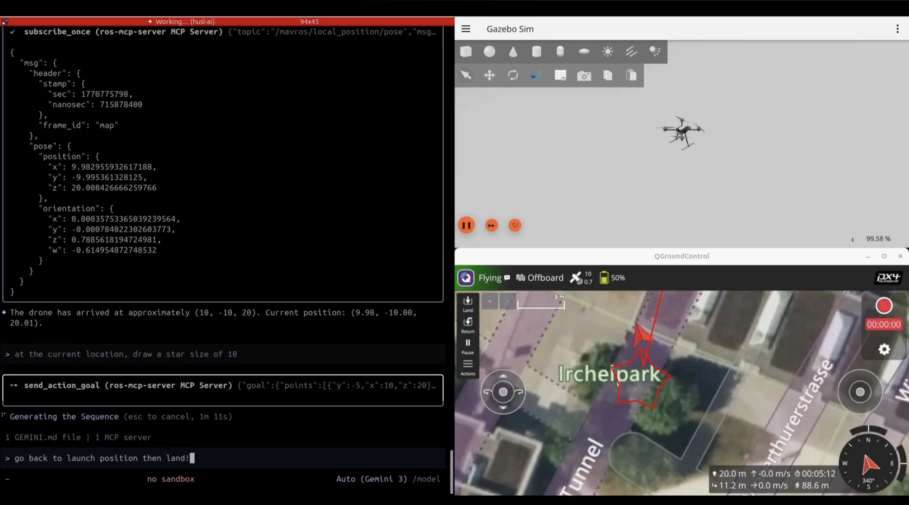

# Example - PX4 Drone (Gazebo Sim)


This is an example of ROS MCP server’s capabilities using **Gazebo** with the **PX4 Autopilot** drone simulation.

This example demonstrates how to control a PX4-based drone using the MCP Server (Gemini CLI) and custom ROS 2 Actions.

## Demo Video

[](https://www.youtube.com/watch?v=qVNO6Emfp_w)

## System Requirements
This example requires a PC capable of running Gazebo and PX4 SITL.
- **OS**: Ubuntu 24.04
- **ROS2**: Jazzy Jalisco
- **Simulator**: Gazebo (Harmonic/Garden as used by PX4)
- **Geimini CLI** (or other MCP Clients at your convenience)

## Prerequisites
Before starting, ensure you have the following installed:
- **ROS2 Jazzy**: [Install ROS2](https://docs.ros.org/en/jazzy/Installation/Ubuntu-Install-Debians.html)
- **PX4 Autopilot**: (See Quick Start)
- **QGroundControl**: (See Quick Start)

## Quick Start

### 1. Install PX4 Autopilot
Follow the official [PX4 User Guide](https://docs.px4.io/main/en/ros2/user_guide) or use these commands:

```bash
cd ~
git clone https://github.com/PX4/PX4-Autopilot.git --recursive
bash ./PX4-Autopilot/Tools/setup/ubuntu.sh
# You may need to logout and login again after the setup script finishes
cd PX4-Autopilot/
make px4_sitl
```

### 2. Install MAVROS (ROS 2 Jazzy)
```bash
cd ~
sudo apt install ros-jazzy-mavros ros-jazzy-mavros-extras
wget https://raw.githubusercontent.com/mavlink/mavros/ros2/mavros/scripts/install_geographiclib_datasets.sh
sudo bash ./install_geographiclib_datasets.sh
```

### 3. Install QGroundControl
```bash
sudo usermod -a -G dialout $USER
sudo apt-get remove modemmanager -y
sudo apt install gstreamer1.0-plugins-bad gstreamer1.0-libav gstreamer1.0-gl -y
sudo apt install libfuse2 -y
sudo apt install libxcb-xinerama0 libxkbcommon-x11-0 libxcb-cursor-dev -y

# Download and run QGC (change directory to where you want to download)
cd ~/Downloads
wget https://d176tv9ibo4jno.cloudfront.net/latest/QGroundControl-x86_64.AppImage
chmod +x ./QGroundControl-x86_64.AppImage
```

### 4. Install This Package (rms-dronecmd)
```bash
# Navigate to the workspace within this example
cd ../drone_ws
colcon build --symlink-install
source install/setup.bash
```

## Launch Simulation
You will need multiple terminal tabs to run the full stack.

### Terminals 1 & 2: Simulator & GCS
**Terminal 1: PX4 SITL**
```bash
cd ~/PX4-Autopilot
make px4_sitl gz_x500
```

**Terminal 2: QGroundControl**
```bash
# Navigate to where you downloaded QGC
cd ~/Downloads
./QGroundControl-x86_64.AppImage
```

### Terminals 3 & 4: ROS & Control
**Terminal 3: MAVROS Bridge**
```bash
# Connects ROS2 to the PX4 SITL simulation
source /opt/ros/jazzy/setup.bash
ros2 launch mavros px4.launch fcu_url:="udp://:14540@127.0.0.1:14557"
```

**Terminal 4: Drone Controller Node**
```bash
# Runs the custom bridge node that handles safety & high-level actions
source /opt/ros/jazzy/setup.bash
source install/setup.bash
ros2 run drone_controller bridge
```

## Integration with MCP Server

### Start rosbridge
To enable communication with the **ros-mcp-server**, run rosbridge in a new terminal:

**Terminal 5: ROS Bridge Server**
```bash
source /opt/ros/jazzy/setup.bash
source install/setup.bash
ros2 launch rosbridge_server rosbridge_websocket_launch.xml 
```

### Connect with Gemini / MCP Client
1. Run your MCP client (e.g., Gemini).
2. **Prompt:** "I am controlling a drone_px4. Connect to localhost and load the drone_px4 robot configuration."

## Example Walkthrough
Once connected, you can use natural language to control the drone.

### Example Commands
- "Takeoff to 10 meters"
- "Fly square pattern (Side length 10m)"
- "Orbit at 10m radius"
- "Return to launch"

### Check Simulation
You can verify the connection by checking ROS topics:
```bash
ros2 topic list
```
You should see `/mavros/state`, `/drone_control/takeoff/_action/status`, etc.

## Available Actions (Technical)
The `drone_controller` node exposes these high-level actions:

### **Features**
-   **Smoothed 50Hz Control Loop**: Updates at 50Hz for responsive control.
-   **Setpoint Interpolation**: "Carrot-following" logic eliminates jerkiness by moving a virtual setpoint at constant speed.
-   **Fly Through Mode**: Smoothly transitions between waypoints without stopping.

### **Actions**

1.  **Takeoff** (`drone_interfaces/action/DroneTakeoff`)
    -   Server: `/drone_control/takeoff`
    -   Goal: `float32 target_altitude`

2.  **Trajectory** (`drone_interfaces/action/DroneTrajectory`)
    -   Server: `/drone_control/trajectory`
    -   Goal: 
        -   `geometry_msgs/Point[] points`
        -   `float32 speed` (m/s, default 1.0)
        -   `float32 tolerance` (Arrival radius)
        -   `bool fly_through` (True = Continuous motion)
