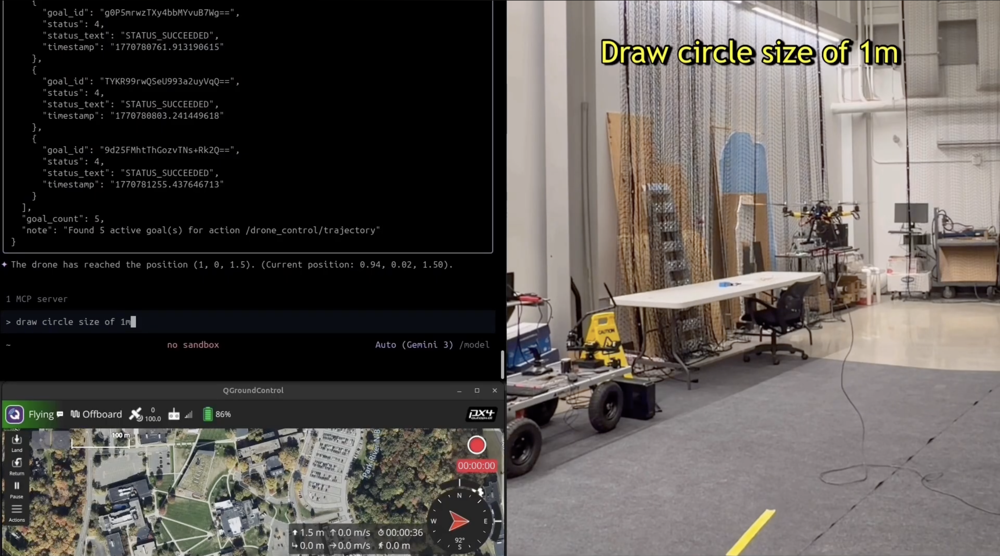
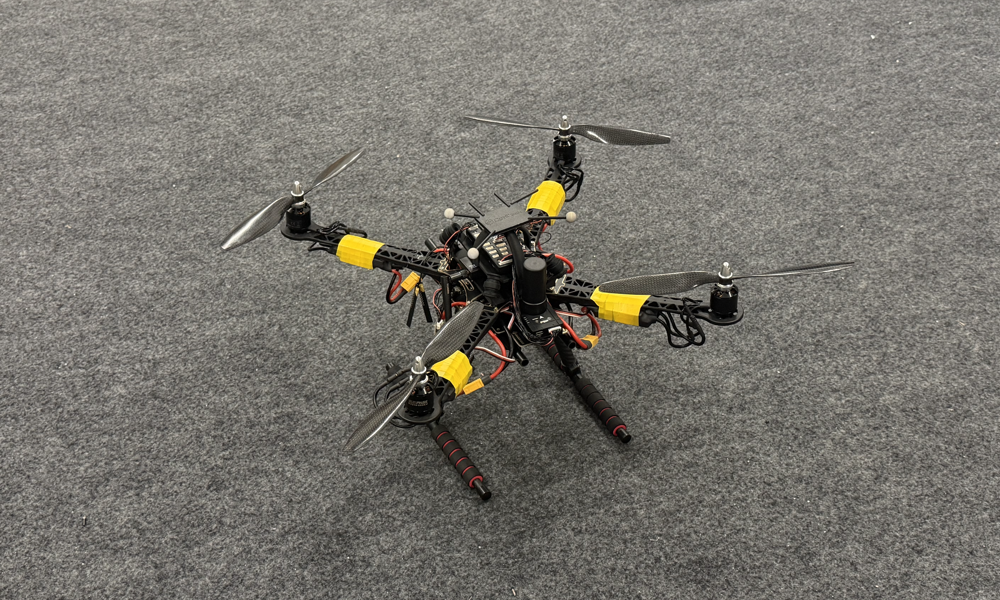

# Example - PX4 Drone (Real)


This example guides you through controlling a real PX4-based drone using the ROS MCP Server.

## Demo Video

[](https://www.youtube.com/watch?v=TRhr7QfWoTI)

**Note:** This setup shares the same ROS2 workspace as the Gazebo simulation example (`../drone_ws`).

**Note:** The test flight was conducted in the motion capture arena of the authors. GPS position data was replaced with the mocap data.

## System Requirements
- **Onboard Computer**: Ubuntu 24.04
- **ROS2**: Jazzy Jalisco
- **Flight Controller**: PX4 Autopilot (Connected via MAVLink)
- **(Option) Motion Capture System**: Stable Indoor Test Flight Environment

### Pixhawk Based Custom Drone



## Setup & Installation

### 1. Build the Workspace
Since the control code is shared, navigate to the `drone_ws` directory and build it.

```bash
cd ../drone_ws
colcon build --symlink-install
source install/setup.bash
```

### 2. Connect to Flight Controller
Ensure your companion computer is connected to the Flight Controller (Pixhawk)

Reference
- PX4 - Companion Computers https://docs.px4.io/main/en/companion_computer/
- PX4 - Using a Companion Computer with Pixhawk Controllers  https://docs.px4.io/main/en/companion_computer/pixhawk_companion
- PX4 - MAVLink Peripherals (GCS/OSD/Gimbal/Camera/Companion) https://docs.px4.io/main/en/peripherals/mavlink_peripherals

### 3. Launch MAVROS
Start the MAVROS node to bridge MAVLink to ROS2 topics.

```bash
# Example: USB/Serial connection
# Adjust fcu_url based on your device path and baudrate
ros2 launch mavros px4.launch fcu_url:="serial:///dev/ttyUSB0:921600" gcs_url:="udp://@127.0.0.1"
```

### 4. Launch the Control Node
```bash
# In the drone_ws folder
source install/setup.bash
ros2 run drone_controller bridge
```

### 4. (Optional) Launch Motion Capture Node
Reference
- Computer Vision (Optical Flow, MoCap, VIO, Avoidance) https://docs.px4.io/main/en/advanced/computer_vision
- Using Vision or Motion Capture Systems for Position Estimation https://docs.px4.io/main/en/ros/external_position_estimation
- Motion Capture (MoCap) https://docs.px4.io/main/en/computer_vision/motion_capture

## Integration with MCP Server

### Start rosbridge
To enable communication with the **ros-mcp-server**:

```bash
source /opt/ros/jazzy/setup.bash
source install/setup.bash
ros2 launch rosbridge_server rosbridge_websocket_launch.xml 
```

### Connect with Gemini / MCP Client
1. Ensure your MCP client machine is on the same network as the drone.
2. **Prompt:** "I am controlling a drone_px4. Connect to `<DRONE_IP_ADDRESS>` and load the drone_px4 robot configuration."

## Available Actions
The actions and commands are identical to the simulation example. Please refer to `../gazebo_sim/README.md` or the robot specification for details.
