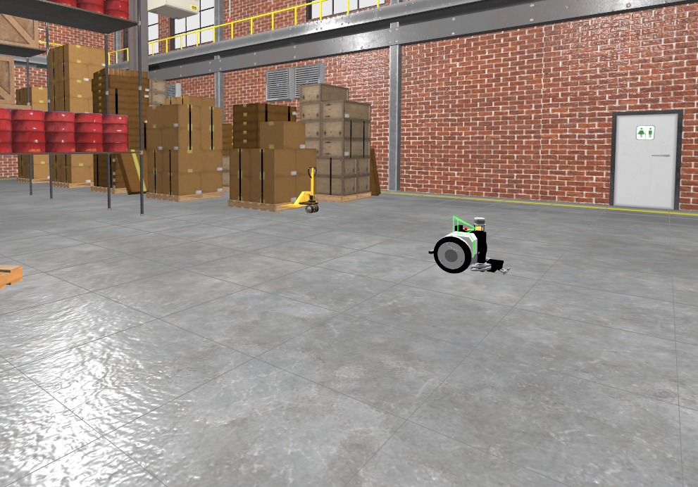
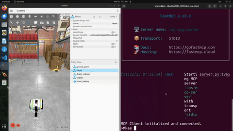

# Example 11: Tugbot Warehouse Simulation (Ignition Gazebo)

This example demonstrates how to control a **Tugbot mobile robot** inside a warehouse environment using **Ignition Gazebo (Fortress)** and the **ROS-MCP Server**.



Using natural language and the `ROS-MCP server`, you can control and navigate the robot in the simulation, inspect its sensors (Lidar), and check its position.

## Working Demo



## 📋 Tested On

This example has been tested and verified on:

  * **OS:** Ubuntu 22.04 LTS
  * **ROS Distro:** ROS 2 Humble
  * **Simulator:** Ignition Gazebo Fortress
  * **Python Manager:** `uv`

> **Note:** We recommend using a Linux-based OS or a VM, as Gazebo compatibility may vary on other operating systems.

## 🛠️ Prerequisites

Before running this example, ensure you have the necessary ROS 2 and Gazebo packages installed on your system:

```bash
sudo apt update
sudo apt install ros-humble-ros-gz          # Bridge between ROS 2 and Ignition
sudo apt install ros-humble-rosapi          # Required for introspection (listing topics)
sudo apt install ros-humble-rosbridge-server # WebSocket connection for MCP
```

## 📦 Installation & Setup

This project uses `uv` for environment management. Because ROS nodes (like `rosbridge` and `rosapi`) run inside this virtual environment, we must install specific system bindings into the virtual environment.

1.  **Create and Activate Virtual Environment:**
    Navigate to the root of the repository and run:

    ```bash
    uv venv
    source .venv/bin/activate
    ```

2.  **Install Dependencies:**
    We have defined a special `bridge` dependency group that handles the ROS-Python bindings (fixing common `ModuleNotFoundError: bson/tornado` errors).

    ```bash
    # Install the package plus the bridge requirements
    uv pip install -e .[bridge]
    ```

## 🚀 How to Run

### 1\. Launch the Simulation & Bridges

We have provided a custom launch file (`tugbot_sim.launch.py`) that starts Ignition Gazebo, the ROS-GZ Bridge, the Rosbridge Websocket, and the ROS API node simultaneously.

```bash
source /opt/ros/humble/setup.bash
source .venv/bin/activate

# Launch the simulation
ros2 launch examples/11_tugbot/tugbot_sim.launch.py
```

*Wait until you see the warehouse environment and the robot appear in the simulation window.*

### 2\. Start the MCP Server

Use the [robot-mcp-client](https://github.com/robotmcp/robot-mcp-client) or any of the MCP Desktop clients (Claude Desktop/Goose/etc).

## 🤖 Sample Prompts & Use Cases

Once connected, the AI has full access to the robot's navigation and sensor data. Here are prompts that are tested and working:

### 1\. Navigation (Movement)

The robot uses a differential drive controller listening on `/cmd_vel`.

> "Make the robot go in a circle"

> "Move the robot forward at 0.5 m/s."

> "Turn the robot 90 degrees to the left."

> "Stop the robot immediately."

> "Drive forward for 3 seconds, then stop."

### 2\. Discovery

The AI can query the system to understand what tools are available.

> "List all available topics."

> "Check the active nodes and tell me if the simulation bridge is running."

> "What kind of message type does the /cmd\_vel topic expect?"

### 3\. Perception & State (Sensors)

The Tugbot is equipped with a Lidar and Odometry sensors.

> "What is the robot's current position (check odometry)?"

> "Read the /scan topic and tell me if there are obstacles nearby."

> "Monitor the robot's velocity."

## ⚠️ Troubleshooting

**Issue: "Service /rosapi/topics does not exist"**

  * **Cause:** The `rosapi` node is not running or crashed.
  * **Fix:** Ensure you installed the dependencies using `uv pip install -e .[bridge]`. The `bridge` extras install `netifaces`, which `rosapi` requires to start.

**Issue: Robot doesn't move when commanded**

  * **Cause:** Topic mismatch between Ignition and ROS.
  * **Fix:** Verify the bridge mapping in the launch file. It should map `/model/tugbot/cmd_vel` (Ignition) to `/cmd_vel` (ROS).

**Issue: "ModuleNotFoundError: No module named 'bson' or 'tornado'"**

  * **Cause:** Missing Python bindings in the `uv` environment.
  * **Fix:** Run `uv pip install pymongo tornado` (or reinstall with the `.[bridge]` flag).

## 📂 File Structure

  * `tugbot_sim.launch.py`: The main entry point. Orchestrates Gazebo, ROS Bridge, and MCP connection.
  * `tugbot_depot.sdf`: The 3D environment file (downloaded from Gazebo Fuel).
