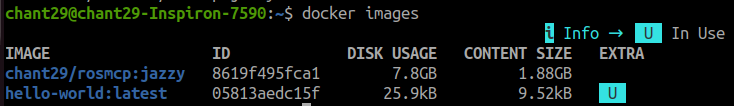
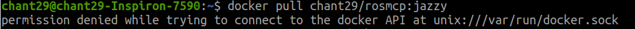
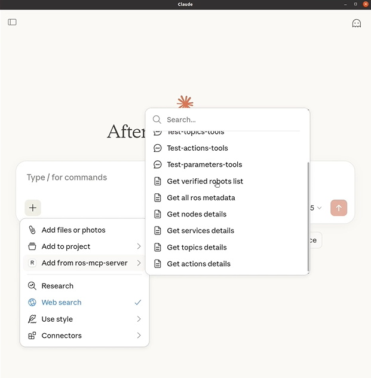

# Example - Turtlebot3 (Gazebo)

## Tutorial Overview

This tutorial series consists of three progressively advanced stages:

- **Tutorial 1**: Basic integration of ROS-MCP and TurtleBot3 in Gazebo
- **Tutorial 2**: LLM-driven Navigation Integration using Nav2
- **Tutorial 3**: Advanced ROS-MCP Application in Complex Environments

Each tutorial builds on the previous one and is designed to gradually introduce
ROS-MCP concepts and practical robot control workflows. A pre-configured Docker image is provided to enable quick environment setup without requiring manual installation.

<p align="center">

</p>

- Turtlebot3: A standard mobile robot platform that enables immediate experimentation with ROS based robot control without complex setup.
- Gazebo Sim : A simulator that offers simple and stable integration with ROS, allowing users to quickly start robot control experiments.
- Docker : A tool that simplifies software setup by providing pre-built environments, allowing users to run complex systems without manual dependency installation.

## **Prerequisites**

Before starting this tutorial, make sure you have the following installed:

- **The ROS MCP Server installed** (see [Installation Guide](https://github.com/robotmcp/ros-mcp-server/blob/main/docs/installation.md) for setup instructions)
- **Docker**
    - Linux (Recommended) : [Install Docker Engine](https://docs.docker.com/engine/install/ubuntu/#install-using-the-repository)
    - Windows : [Install Docker Desktop](https://docs.docker.com/desktop/setup/install/windows-install/)
    
- The Docker image requires ~10GB of disk space

### ✅ **Note : GUI Display Environment Setup**

This step enables GUI visualization tools such as Gazebo and RViz to be displayed on the host machine when running inside Docker.

> This tutorial assumes Gazebo is executed inside a Docker container. GUI compatibility issues may occur on Windows. A Linux environment is therefore recommended.

<details>
<summary><strong>Windows</strong></summary>


**X Server** (for Windows): Install [X410](https://x410.dev/) or another X Server from Microsoft Store

For Windows users, make sure you install an X Server (X410) and set the DISPLAY variable for Docker in Powershell.

```powershell
$env:DISPLAY="host.docker.internal:0.0"
```
</details>

<details>
<summary><strong>Linux</strong></summary>


**X11 forwarding** (for Linux): `sudo apt-get install x11-apps` 

To enable GUI visualization on the host from a Docker conatiner, run the following command outside the Docker conatiner.

```powershell
xhost +local:root
# Locate and edit the claude_desktop_config.json file:

~/.config/Claude/claude_desktop_config.json

```

</details>


## **Setup Environment**

If you have already completed the previous tutorial, you do not need to repeat this step.

- **Pull the Docker image:**
    
    ```bash
    docker pull chant29/rosmcp
    ```
    
- **Verify docker images:**
    
    ```bash
    docker images
    ```
    
    You should verify that the downloaded image has been pulled successfully like this:
    
    <p align="center">
    
    </p>
    
- **Run docker container**
    - Linux
    
        ```bash
        # Docker container run
        docker run -it --name mcpjazzy --gpus all --net=host \
        -e DISPLAY=$DISPLAY \
        -e QT_X11_NO_MITSHM=1 \
        -v /tmp/.X11-unix:/tmp/.X11-unix:rw \
        -v "$HOME/.Xauthority:/root/.Xauthority:rw" \
        -e NVIDIA_DRIVER_CAPABILITIES=all \
        -e __GLX_VENDOR_LIBRARY_NAME=nvidia \
        -e XAUTHORITY=/root/.Xauthority \
        chant29/rosmcp
        ```
    
    - Windows
    
        ```bash
        # Windows PowerShell
        
        docker run -it --name mcpjazzy --gpus all -p 9090:9090 `
        -e DISPLAY=host.docker.internal:0 `
        -e QT_X11_NO_MITSHM=1 `
        -e NVIDIA_DRIVER_CAPABILITIES=all `
        -e __GLX_VENDOR_LIBRARY_NAME=nvidia `
        -v /tmp/.X11-unix:/tmp/.X11-unix:rw `
        chant29/rosmcp
        ```
    
- **Access the Docker Container**
    
    ```bash
    # Run docker container 
    docker start -ai mcpjazzy
    
    # Connect to docker container
    docker exec -it mcpjazzy bash
    ```
    

## **Install and Configure the MCP Server**

If you haven't already set up the ROS MCP Server, follow the detailed [Installation Guide](https://file+.vscode-resource.vscode-cdn.net/home/jaegyun/ros-mcp-server/docs/installation.md). The MCP server can run on:

<details>
<summary><strong>Claude Desktop</strong></summary>

If the ROS-MCP server is successfully connected, the `ros-mcp-server` connector will appear enabled (blue toggle) in Claude’s Connectors UI.
<p align="center">

</p>

</details>

## Troubleshooting

<details>
<summary><strong>Docker</strong></summary>

- **Docker permission denied**
    <p align="center">
    
    </p>
    
    - This error means that the user does not have permission to access `/var/run/docker.sock`. On Linux, this is a very common issue that almost always occurs when Docker is installed for the first time.
    - This issue can be resolved by running the following command and then rebooting to apply the changes.
        
        ```bash
        sudo usermod -aG docker $USER
        ```
</details>

## 🎥 Tutorial Video (3min)

<a href="https://www.youtube.com/watch?v=IKipVzyekKg&list=PLBxtOZLOZTo9hqCvFNJTXWSGserz18cAv&index=1"></a>

### 👉 [Tutorial – Part 1](https://www.youtube.com/watch?v=IKipVzyekKg&list=PLBxtOZLOZTo9hqCvFNJTXWSGserz18cAv&index=1)


