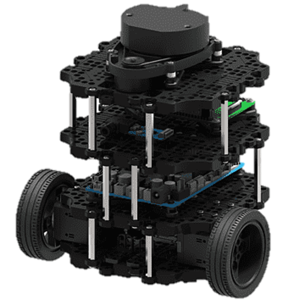
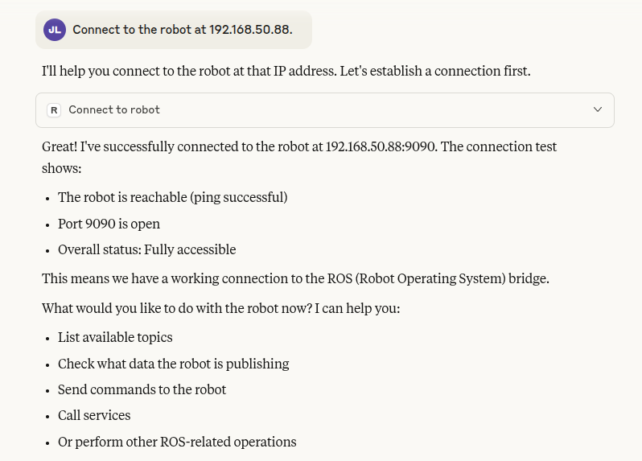
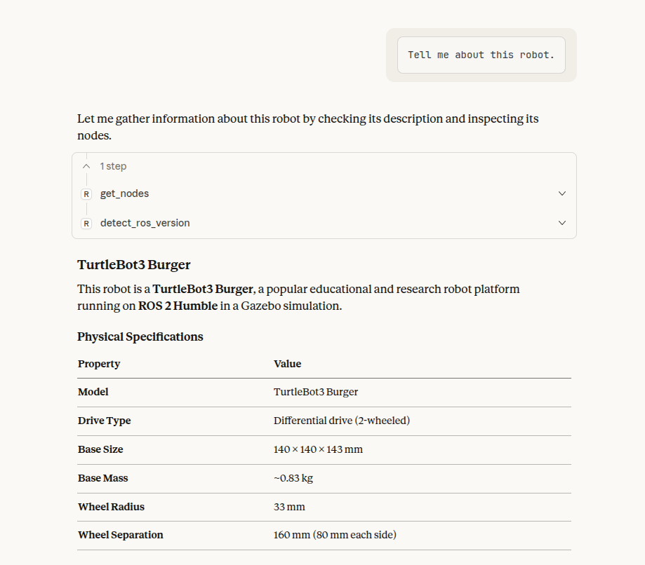
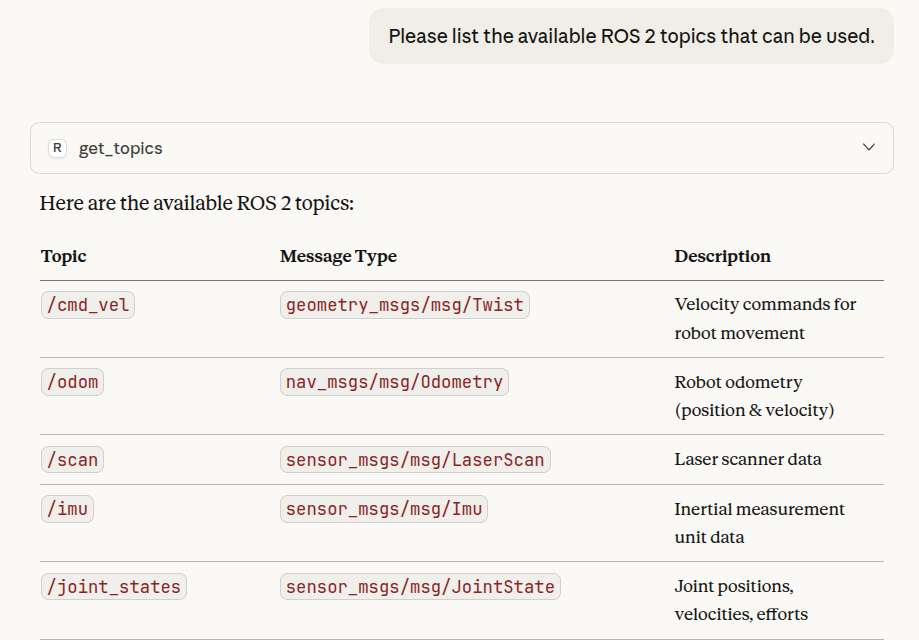
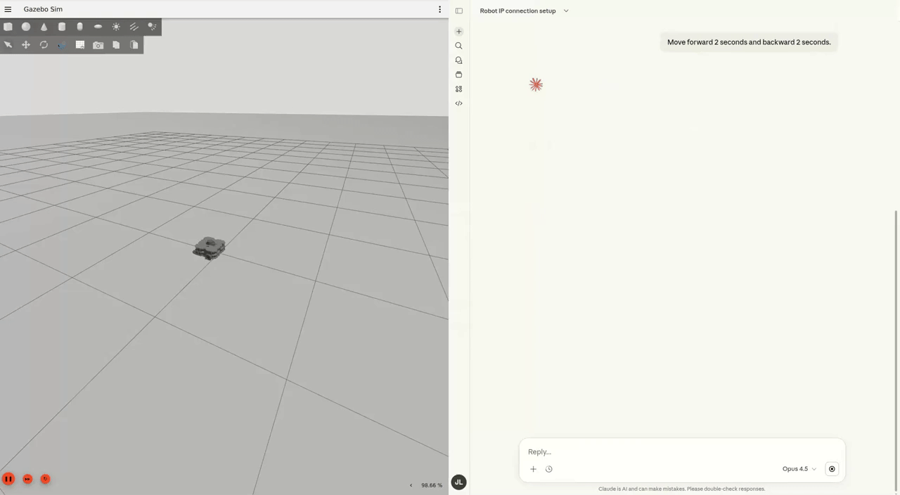
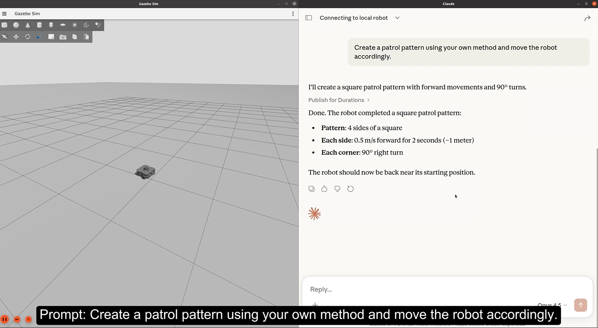

# Tutorial1: ROS-MCP and TurtleBot3 basic integration in Gazebo Sim

This is **the first tutorial** in the Nav2 integration with ROS-MCP-server. It aims to provide hands-on experience in controlling a TurtleBot3 in a Gazebo simulation environment using an LLM through a ROS-MCP server.

TurtleBot3 is a standard learning platform that closely mirrors the structure and control flow of a real mobile robot. Through this setup, users can experience the entire pipeline in which an LLM interprets natural language commands and issues actual robot control commands via ROS-MCP.

<p align="center">

</p>

## **What you’ll learn**

By the end of this tutorial, you’ll be able to:

- Launch Turtlebot3 on your ROS system
- Control the Turtlebot3 using natural language commands through the MCP server
- Learn how an LLM interacts with ROS 2 topics and services via a ROS-MCP server

## **Launch ROS Nodes**

- **Run the Simulation**
    
    ```bash
    docker exec -it mcpjazzy bash
    ros2 launch turtlebot3_gazebo empty_world.launch.py
    ```
    
    - `TURTLEBOT3_MODEL` is an environment variable that specifies which TurtleBot3 model to use (`burger`, `waffle`, or `waffle_pi`).
        
        ```bash
        export TURTLEBOT3_MODEL=burger # options: burger, waffle, waffle_pi
        ```
        
    - TurtleBot3 launch files use this variable to load the correct robot description, sensors, and physical parameters.
    - If the variable is not explicitly set, `TURTLEBOT3_MODEL` is set to `waffle_pi` by default.
- **Run the rosbridge_server**
    
    ```bash
    # Launch rosbridge
    docker exec -it mcpjazzy bash
    ros2 launch rosbridge_server rosbridge_websocket_launch.xml  
    ```
    

## **Hands-on Exploration with MCP Server**

<details>
<summary><strong>Example 1 : Connect to robot</strong></summary>

- Connect to the robot using its IP address.

    You can check the IP address using the `ifconfig` command. When running in simulation, using the local IP address `127.0.0.1` is also acceptable.

    

</details>

<details>
<summary><strong>Example 2 : Tell me about this robot</strong></summary>




</details>
<details>
<summary><strong>Example 3 : ROS Topic Check</strong></summary>




</details>
<details>
<summary><strong>Example 4 : Basic motion test</strong></summary>




</details>

### **💡 Pro Tips**

- **Be specific**: Instead of "move", try "move backward at 3 m/s"
- **Ask questions**: "What can this robot do?"
- **Experiment with multi-step commands:** “Turn left 90 degrees, move forward 2 seconds. then return to the starting positon”
- **Test abstraction** : “Explore the area” Pay attention to how the LLM interprets your instructions!

### Next Steps

1. **Try running the navigation demo**

    Using the Nav2 features provided by TurtleBot3, more complex tasks can be carried out.

2. **Connect to real robots**
    
    Use the ROS-MCP server to control a real-world mobile robot.

## 🎥 Tutorial Video (3min)

<a href="https://www.youtube.com/watch?v=xRvU1laJi0Q&list=PLBxtOZLOZTo9hqCvFNJTXWSGserz18cAv&index=2"></a>

### 👉 [Tutorial – Part 2](https://www.youtube.com/watch?v=xRvU1laJi0Q&list=PLBxtOZLOZTo9hqCvFNJTXWSGserz18cAv&index=2)

