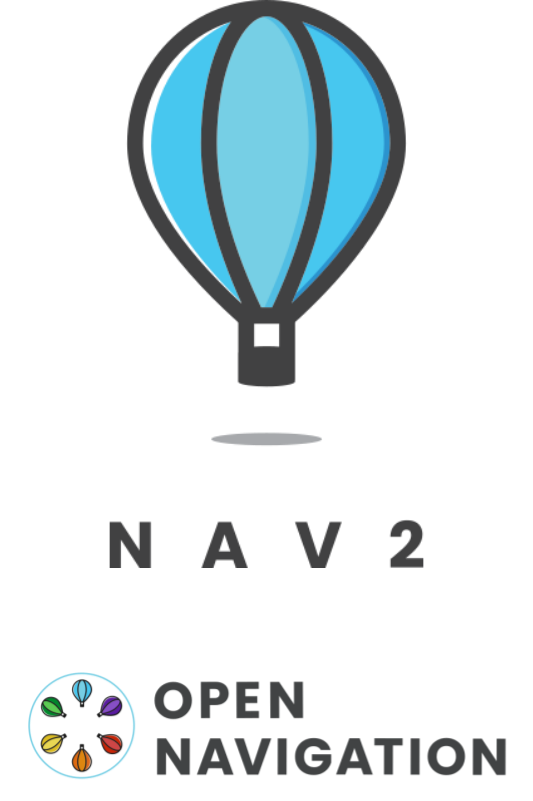
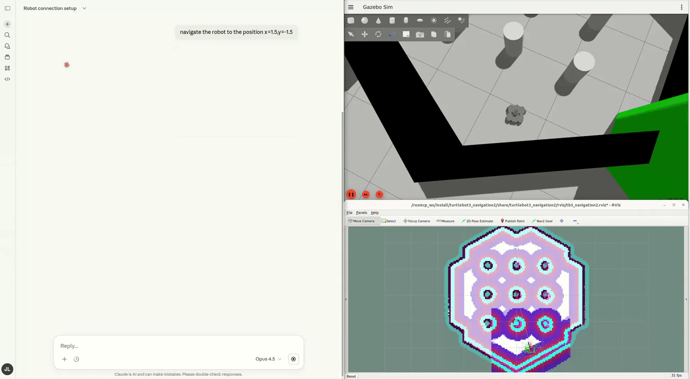
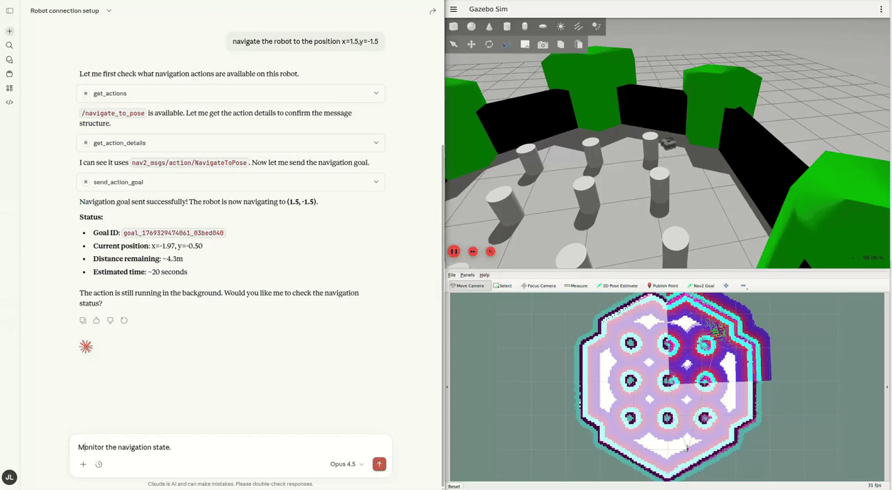
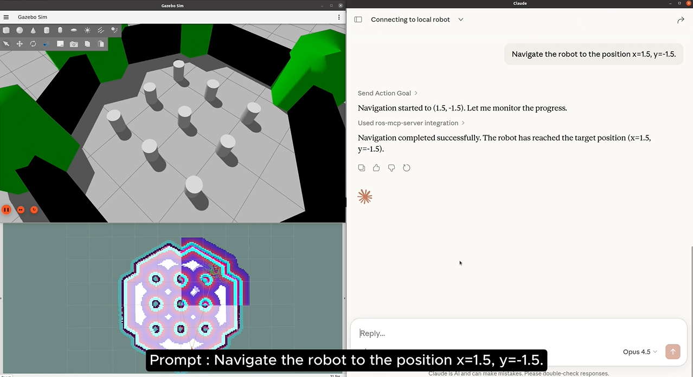

# Tutorial 2: LLM-driven Navigation Integration using Nav2
**The second tutorial** extends the previous setup by integrating Nav2, one of the core open-source navigation frameworks in ROS, and demonstrates LLM-based robot navigation.

<p align="center">

</p>

Nav2 is the standard navigation framework in ROS 2 that enables autonomous robot navigation, including path planning and obstacle avoidance. In this tutorial, Nav2 is used to execute navigation tasks commanded by an LLM on a TurtleBot3 in a Gazebo simulation environment.

## **What you’ll learn**

By the end of this tutorial, you’ll be able to:

- Launch Turtlebot3 on your ROS system
- Autonomous navigation with Nav2 in a Gazebo environment
- How an LLM interprets natural language commands and triggers navigation behaviors

## **Launch ROS Nodes**

- Run the Simulation
    
    ```bash
    docker exec -it mcpjazzy bash
    ros2 launch turtlebot3_gazebo turtlebot3_world.launch.py
    ```
    
    - `TURTLEBOT3_MODEL` is an environment variable that specifies which TurtleBot3 model to use (`burger`, `waffle`, or `waffle_pi`).
        
        ```bash
        export TURTLEBOT3_MODEL=burger # options: burger, waffle, waffle_pi
        ```
        
    - TurtleBot3 launch files use this variable to load the correct robot description, sensors, and physical parameters.
    - If the variable is not explicitly set, `TURTLEBOT3_MODEL` is set to `waffle_pi` by default.
- Launch the navigation stack
    
    ```bash
    docker exec -it mcpjazzy bash
    ros2 launch turtlebot3_navigation2 navigation2.launch.py use_sim_time:=true
    ```
    
    - If you change the `TURTLEBOT3_MODEL` when launching the simulation node, you must use the same model setting when starting the navigation stack.
- Run the rosbridge_server
    
    ```bash
    # Launch rosbridge
    docker exec -it mcpjazzy bash
    ros2 launch rosbridge_server rosbridge_websocket_launch.xml  
    ```
    

## **Hands-on Exploration with MCP Server**


<details>
<summary><strong>Example 1 : Navigate the robot</strong></summary>

- Navigate the TurtleBot3 by directly specifying target coordinates.

    

</details>


<details>
<summary><strong>Example 2 : Monitor the navigation state</strong></summary>

- Monitoring the navigation state helps you understand what the robot is currently doing, such as planning a path, moving toward a goal, or handling a problem.

    

</details>

## Next Steps

- In complex environments, use sensor data to allow an LLM to analyze the surroundings, identify objects, and build a semantic map.
- Perform navigation based on the constructed semantic map.
- Multi-step Command Execution (High-level Task Execution): ex: Go to the kitchen, then return to the starting point.

## 🎥 Tutorial Video (3min)

<a href="https://www.youtube.com/watch?v=QSVnMkzhJ_U&list=PLBxtOZLOZTo9hqCvFNJTXWSGserz18cAv&index=3"></a>

### 👉 [Tutorial – Part 3](https://www.youtube.com/watch?v=QSVnMkzhJ_U&list=PLBxtOZLOZTo9hqCvFNJTXWSGserz18cAv&index=3)
