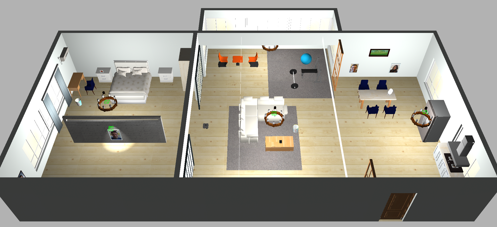
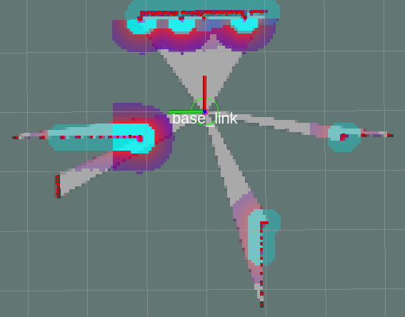
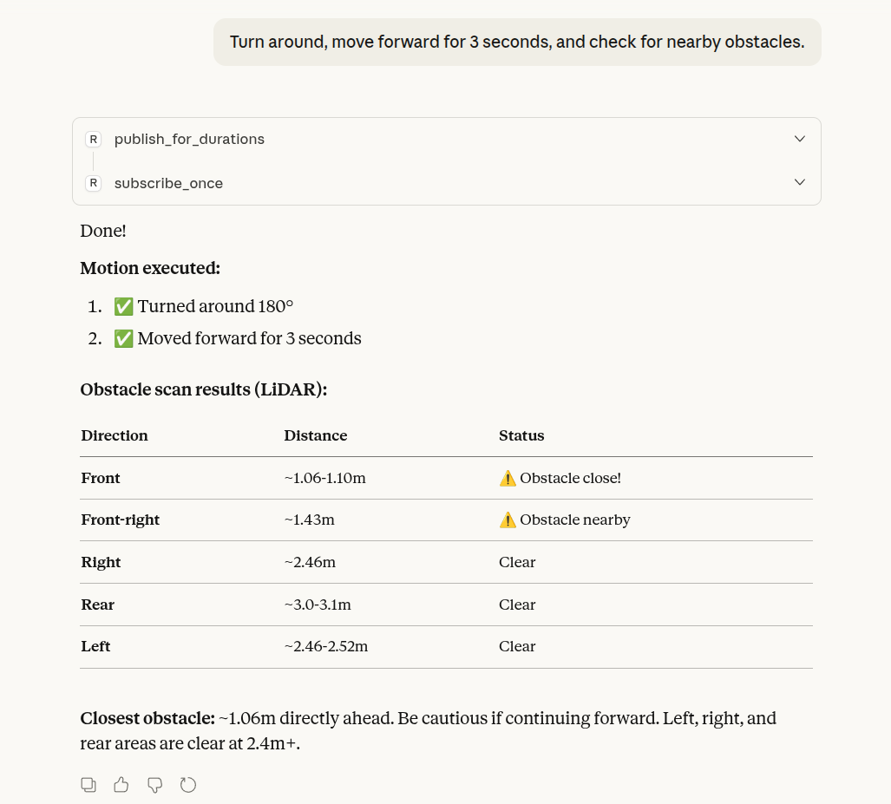
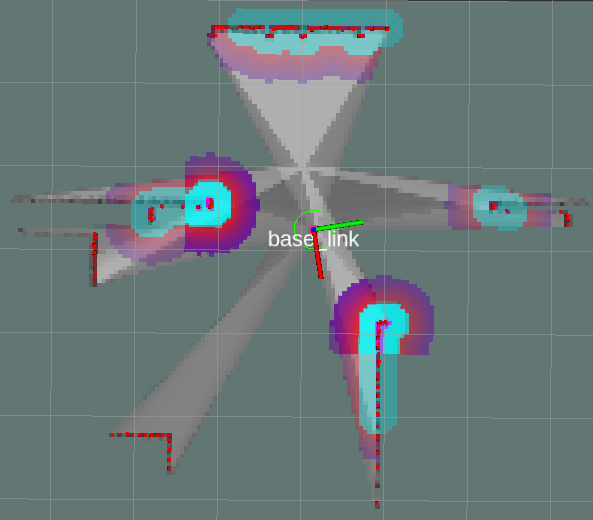
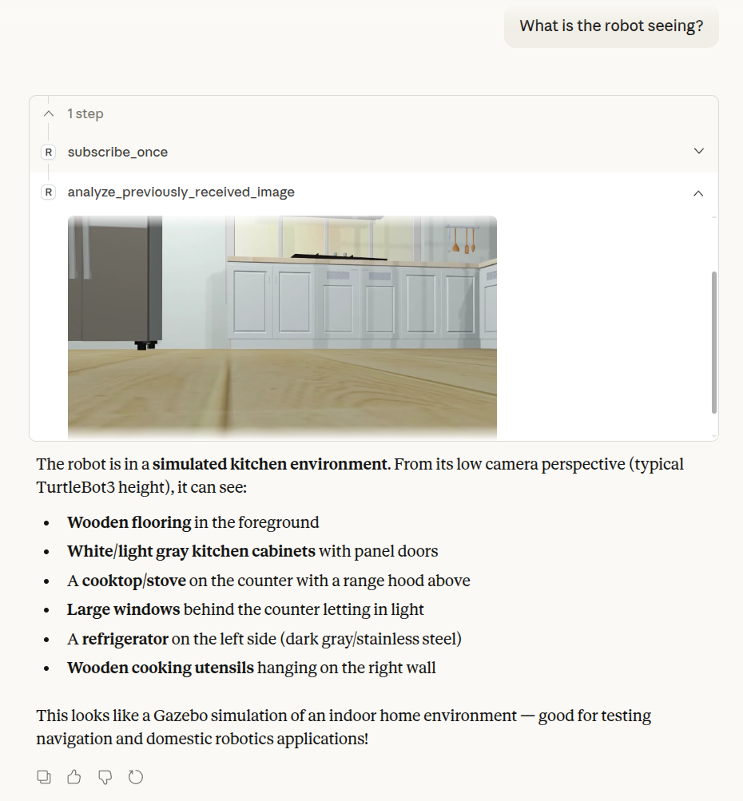
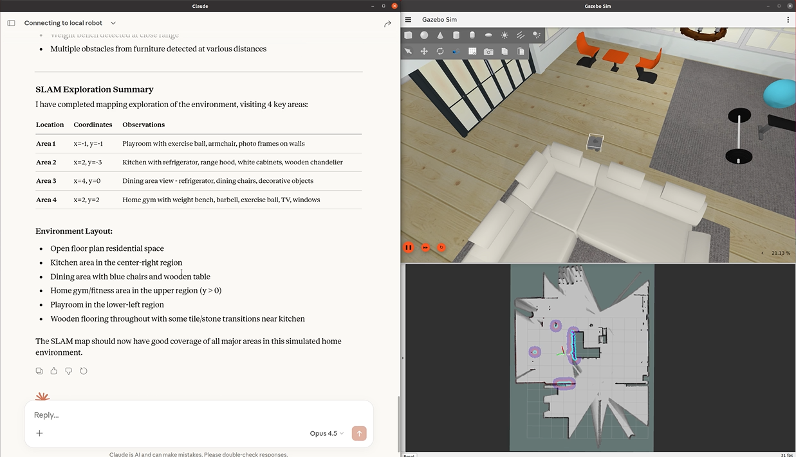
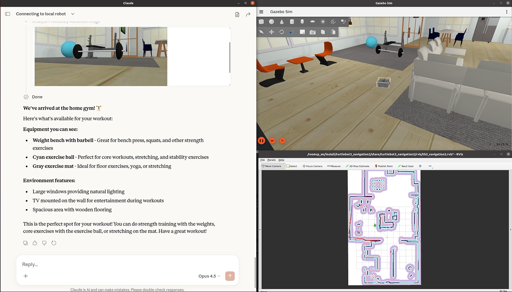

# Tutorial 3: Advanced ROS-MCP Application in Complex Environments
**The third tutorial** shows how to perform LLM-based SLAM and navigation in a complex environment using the ROS-MCP Server.  Using Cartographer and Nav2, you will experience the entire navigation pipeline, from SLAM-based map generation to LLM-triggered goal navigation

To provide a more complex environment for SLAM and navigation, we use the [AWS RoboMaker Small House World](https://github.com/aws-robotics/aws-robomaker-small-house-world)

<p align="center">

</p>

## **What you’ll learn**

By the end of this tutorial, you’ll be able to: 

- Experience performing SLAM through the ROS-MCP Server
- Understand how the ROS-MCP Server enables an LLM to utilize sensor data for navigation tasks
- Learn how to design and operate LLM-based navigation workflows

## **Launch ROS Nodes & Hands-on Exploration with MCP Server**

SLAM and navigation will be performed as separate steps, since they require different nodes to be launched.
<details>
<summary><strong>SLAM with the ROS-MCP server</strong></summary>

### **Launch ROS node**

- **Launch the simulation node**
    
    Open a terminal, enter the Docker container, and start the simulation nodes.
    
    ```bash
    docker exec -it mcpjazzy bash
    ros2 launch turtlebot3_gazebo turtlebot3_smallhouse.launch.py
    ```
    
- **Launch the cartographer node**
    
    Open another terminal and launch the Cartographer node.
    
    ```bash
    docker exec -it mcpjazzy bash
    ros2 launch turtlebot3_cartographer cartographer.launch.py use_sim_time:=true
    ```
    
    If `use_sim_time` is not enabled, the sensor data timing will not be synchronized with the simulation clock, which can result in incorrect or unstable data processing. Make sure to enable this parameter.
    
- **Run the navigation stack**
    
    ```bash
    docker exec -it mcpjazzy bash
    ros2 launch turtlebot3_navigation2 slam_navigation.launch.py use_sim_time:=true
    ```
    
- **Run the rosbridge_server**
    
    ```bash
    # Launch rosbridge
    docker exec -it mcpjazzy bash
    ros2 launch rosbridge_server rosbridge_websocket_launch.xml  
    ```
    
- **Understanding the RViz Visualization**
    
    This visualization shows the SLAM process running in RViz. 
    
    - Red point clouds : Laser scan data collected by the robot.
    - The gray occupancy grid : The map being generated in real time.
    - `base_link` label : The robot’s current pose.
    
    The surrounding sensor observations are continuously integrated to build the environment map.
    
    
    
    
    
- **Saving the Map**
    
    Once the map has been fully generated, use the map saving tool provided by the Nav2 map server to save the map.
    
    ```bash
    
    ros2 run nav2_map_server map_saver_cli \
    -f /rosmcp_ws/src/turtlebot3/turtlebot3_navigation2/map/small_house
    ```
    
    In this tutorial, a pre-generated small_house map is already provided, so saving the map is optional.
    

### **Hands-on Exploration with MCP server**


- #### **Example 1: Basic Motion Control during SLAM**

    **Prompt :** Turn right by 90 degrees, move forward for 3 seconds, and check for nearby obstacles.


    


    **Result in RViz :**

    


    This visualization shows the updated SLAM state after the robot executed the motion command.

- #### Example 2: Autonomous Exploration for SLAM

    In this example, the LLM is instructed to autonomously explore the environment while building a map. 


    


    The LLM converts the high-level task into navigation commands that drive robot movement, allowing the SLAM node to update the map based on newly collected sensor data.

    ### Note :

    Navigation cannot reliably operate in completely unknown areas because the costmap requires observed grid information. Therefore, it is recommended to perform some basic motion first to generate an initial map before using navigation-based SLAM.
</details>

<details>
<summary><strong>Navigation with the ROS-MCP server</strong></summary>

The navigation process is based on the map generated by the SLAM.

### **Launch ROS node**

- **Launch the simulation node**
    
    Open a terminal, enter the Docker container, and start the simulation nodes.
    
    ```bash
    docker exec -it mcpjazzy bash
    ros2 launch turtlebot3_gazebo turtlebot3_smallhouse.launch.py
    ```
    
- **Launch the navigation stack**
    
    ```bash
    docker exec -it mcpjazzy bash
    ros2 launch turtlebot3_navigation2 smallhouse_navigation.launch.py use_sim_time:=true
    ```
    
- **Run the rosbridge_server**
    
    ```bash
    # Launch rosbridge
    docker exec -it mcpjazzy bash
    ros2 launch rosbridge_server rosbridge_websocket_launch.xml  
    ```
    

### **Hands-on Exploration with MCP server**

- #### Example 1: What is the robot seeing?

    

- #### Example 2: Semantic Navigation Using ROS-MCP Server

    **Prompt :** I’m hungry. Can you take me to a place where there’s something to eat?


    


    - The ROS-MCP Server interprets user intent based on predefined knowledge or information obtained through interactions with the LLM, and guides the robot along an appropriate navigation path accordingly.
</details>

## 🎥 Tutorial Video 

- ### Tutorial3 (SLAM Exploration) (7min)
    <a href="https://www.youtube.com/watch?v=vBGCkO61D0U&list=PLBxtOZLOZTo9hqCvFNJTXWSGserz18cAv&index=4"></a>

    ### 👉 [Tutorial – Part 4](https://www.youtube.com/watch?v=IKipVzyekKg&list=PLBxtOZLOZTo9hqCvFNJTXWSGserz18cAv&index=4)

- ### Tutorial3 (Semantic Navigation) (4min)
    <a href="https://www.youtube.com/watch?v=Fm1PxYolFFw&list=PLBxtOZLOZTo9hqCvFNJTXWSGserz18cAv&index=5"></a>

    ### 👉 [Tutorial – Part 5](https://www.youtube.com/watch?v=Fm1PxYolFFw&list=PLBxtOZLOZTo9hqCvFNJTXWSGserz18cAv&index=5)
